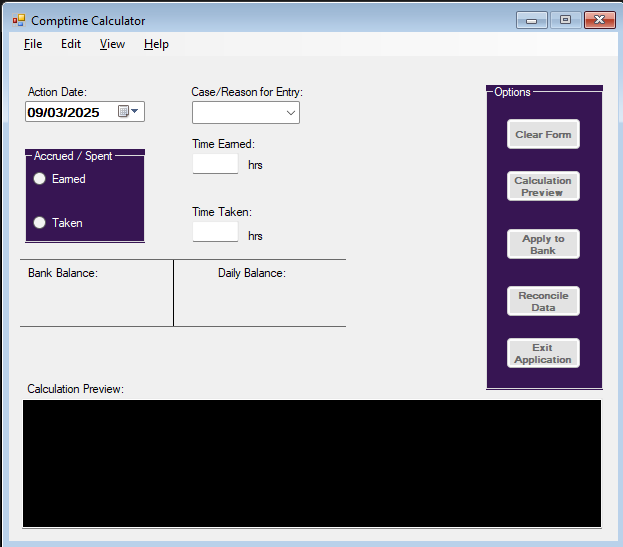
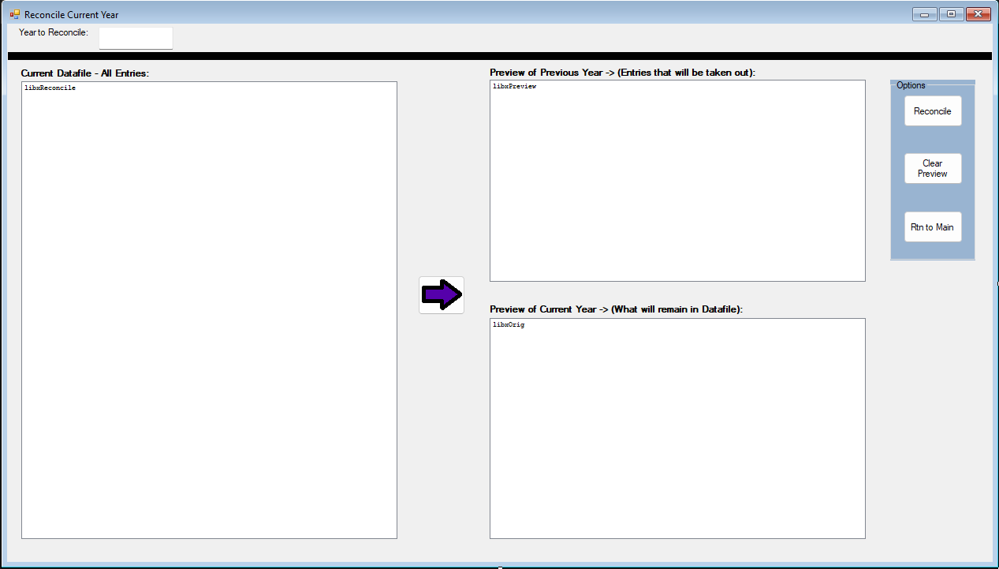

# Comptime Calculator Basic Edition

By Shon Garrison

Originally written in 2009 as part of my programming final at Lamar State College-Orange.  It became the working production software for my office for several years.  

## Program Overview:

This program was written to assist in keeping track of the compensatory time that is accrued when a professional works outside or beyond the average work day/week. This program was mainly written for the Juvenile Probation Department for on-call and extracurricular activities, but it could be adapted to anyone that works as a professional and has to track overtime.  It does not account for straight vs. Compensatory time.  That version is not basic, but original my repository.

Comptime is basically overtime that is accrued at a time of 1.5 times for working beyond an 8-hour day or more than 40 hrs in a given week. This program calculates the time based on that formula (Except chief's edition [straight time] and keeps track of the user's balance through a bank file and a running activity file.  Warning:  Both files created by the program are in plain text.  It can be read by any text editor (WARNING: Not all text editors will display exactly the same just like internet browsers. Notepad works best.) and can be modified outside the program.  Any changes to either file, outside the program, can result in a miscalculation, loss of data, or deletion of transactions.

## Program Functions:

When the program is launched for the first time, it will check for two files: bank and activity sheet.  If the file does not exist, the program will ask to create it. This file is essential for the program to function.  The activity sheet gives you a running look at the activity of the comptime as it is changed.  It works very similarly to a checkbook register.  The program will only check for the file once unless it is deleted or moved, then the process will start over.  However, after the file is created, the program will ask you if you have an initial balance to enter because rarely will the person be starting from scratch unless they are a new employee.  

After the initial balance is obtained, the main form will appear.  You will notice entry text boxes for date, reason, and time accrued/taken.  The radio buttons on the left indicate whether the time is earned or used.  Depending on which button you use, it will deactivate the other corresponding text box.  Note:  You can perform both an accrued and taken at the same time by activating either earned or taken, entering the information, then activating the other, but this must be done prior to hitting the calculation button.  For the best results, I suggest that the user enter one transaction at a time.  This allows the activity sheet to track the changes and updates better.  If two calculations are done at the same time, only one entry will be made into the activity sheet.  It will reflect the correct time, but it will only show one transaction.  Also, if two calculations are done at the same time, the preview text box will only reflect the taken time.

Once the time is entered into the correct box, the user will click the preview button.  The form can not apply to the running balance to the bank before previewing.  The program will calculate the time and place a transaction balance in the daily balance label. The user will also get a preview of the transaction into the activity sheet, but no actual entry will be made by the program until the user clicks the apply to the bank or clear button.  If the user clicks the apply button, the program will ask the user if he or she wants to add it to the bank. The user has the choice to apply it to the bank or clear the form if a mistake has been made.  A yes will add or subtract from the bank, a no will ask if the user wants to return to the program for another calculation.  If the user does not, then the program will direct the user to exit.  The clear button is clearing the form for another transaction.  Pushing this button will ask if the user wants to add the current transaction or just clear the form and start over.  The exit button just exits the program, and if any information is left in the text boxes, it will be ignored and deleted.

The reconcile button takes you to the reconcile form.  On this form, you can cull the previous year's transactions from the running activity sheet and archive them in a folder.

There once was an email form that you email the bank file to a supervisory, but over time, security made it harder and harder to keep it working.  Eventually the form was dropped from the project. 

The tool strip menu at the top of the main form is for convenience.  It allows shortcuts to the bank and activity file as well as exiting the program.  You can access command buttons from there as well.  The user can also find out information about the program from the help tool strip menu item.

I tried to make this program as user-friendly as possible.  The program will ask for decisions before completing any operations.  Should you experience any problems, feel free to contact me.   Enjoy the program!

## Release Notes:

v1.01 - Program created with basic functions for adding and subtracting comptime as needed.

v1.02 - Added popular choices to the reason/case no. combo box

v1.03 - Improved formatting for calendar and date so that the entire file lines up correctly in the activity sheet.

v1.04 - Added text "-" between each transaction to help separate each change to assist users in locating the activity they need.

v2.01 - Major upgrade completed with new functions.  Added apply button in collaboration with co-workers to improve the program.  Added tool strip menu and functions.  Changed and moved calcearned Label to become a preview of what is entered in the affidavit that is turned into the supervisor as well as a preview of the transaction as it will be entered into the register.  Added about form and readme file.

v2.02 - Fixed minor bug with regards to taken preview calculation.  Fixed minor bug with regard to preview display for accrued.

v3.02 (3/2014) - First major update in years.  Added the ability to email the datasheet from within the program.  Currently only allows Orange County employees to email from the County Server, but can be easily modified to include others.  Also vastly improved line-up of text in both preview and comptimerun sheet.

v3.04 - Corrected the path to comptimerun.txt on email sheet.

v4.01 - Added/Completed Reconcile form.  Users can preview the datasheet, previous years' entries, and current year entries. Added the ability to cull the previous year and create a backup of it in its own folder.  Added new choices in reason/case combobox.

v.4.02 - Added email provider options

v.4.10 – Cosmetic Changes, Updated About Form, and Repaired listbox lineup on Reconcile Sheet

v.4.20 - Added Subroutine to address bug whereas the Comptime Folder nor Comtimerun/Bank file
would not be created on the first run if the user did not enter a balance at first start. Updated
README.md file as well as the appropriate Comptime_Calculator_Users_Guide.pdf.

v.4.21 - Cleaned up variables and eliminated the need for the bank file.  The program now pulls the bank
from comptimerun.txt sheet as I always had intended it.

**I am currently working on an updated version of this for my department.  This project is basic. I will not say it's minimalist because it does use a gui, but the newer version that I am working on brings this up-to-date with a major reconfiguration.  The newest version, which I may eventually make public, will track a/the current two-week pay period as well as the bank in two separate files.**  
